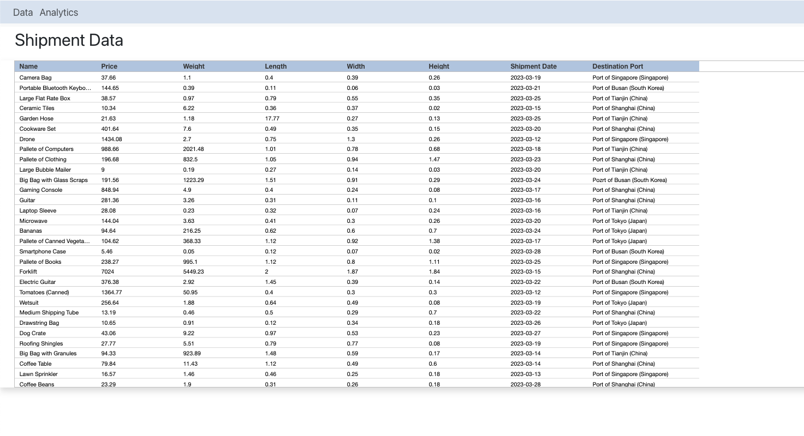
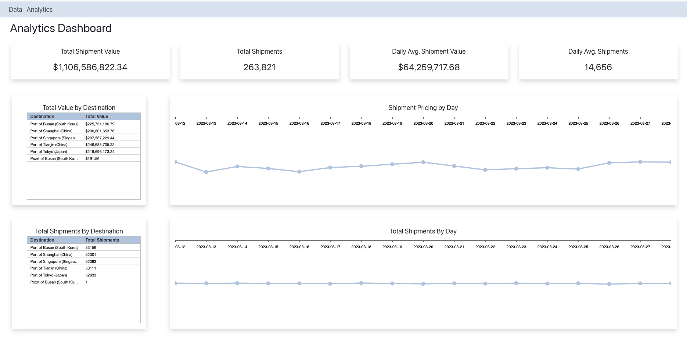

<h1>Port Shipments Dashboard</h1>
<hr>

<div style="border-left: 1px solid #ccc; padding-left: 12px;">
<h2>Table of Contents</h2>
<ul>
    <li><a href="#overview">Overview</a></li>
    <li><a href="#instructions">Instructions</a>
        <ul>
            <li><a href="#api-db-setup">API and Database setup</a></li>
            <ul>
            <li><a href="#running-api">Running the API</a></li>
            <li><a href="#loading-db">Loading the Database</a></li>
            </ul>
            <li><a href="#ui-setup">UI setup</a>
                <ul>
                <li><a href="#running-ui">Running the UI</a></li>
                </ul>
            </li>
            <li><a href="#accessing-application">Accessing the Application</a></li>
        </ul>
    <li><a href="#pages">Pages</a>
    <ul>
    <li><a href="#shipments-data">Shipments Data</a></li>
    <li><a href="#analytics-dashboard">Analytics Dashboard</a></li>
    </ul>
    </li>
    

</ul>
</div>

<div style="border-left: 1px solid #ccc; padding-left: 12px;" id="overview">
<h2>Overview:</h2>
<p>
This is a full-stack application created using an ASP.NET back-end, React.js front-end,
with additional technologies and frameworks. The application itself is a dashboard that
displays data and analytics for international port shipments.
</p>
</div>


<div style="border-left: 1px solid #ccc; padding-left: 12px;" id="instructions">
<h2>Instructions:</h2>
<p> Getting this application running is seperated into two parts:
    <ul>
        <li>Initializing the API and SQLite database</li>
        <li>Initializing the UI</li>
    </ul>
</p>

<h3 id="api-db-setup">
API and Database Setup
</h3>

<h4 id="running-api">
Running the API
</h4>
<p>
Run the dotnet API from the <em>/api</em> directory
</p>

```bash
cd api;
dotnet run;
```

<p>
Running the dotnet API for the first time should restore the dotnet package references,
initialize the sqlite database, and run the database schema migrations.
</p>

<h4 id="loading-db">
Loading the Database
</h4>

<p>You can load the csv data into the database table by running the commands below.</p>

```bash
sqlite3 myapp.db;
.read sql/loadCsvData.sql
```

<p>
Once the API is running and the database table has been loaded, the API endpoints
should now be working.
</p>


<h3 id="ui-setup">
UI Setup
</h3>
<h4 id="running-ui">
Running the UI
</h4>
<p>
Run the React UI from the <em>/ui</em> directory in a separate terminal.
</p>

```bash
cd ui;
npm run start;
```

<h3 id="accessing-application">
Accessing the Application
</h3>

<p>
Once the API and UI are both running, you should be able to access the webpage hosted by the React application.
</p>


</div>

<div style="border-left: 1px solid #ccc; padding-left: 12px;" id="pages">
<h2>Pages:</h2>

<h3 id="shipments-data">
Shipment Data
</h3>
<p>
Displayed in this page is the shipment data from the Shipments table.
</p>



<h3 id="analytics-dashboard">
Analytics Dashboard
</h3>

<p>
Displayed in this page is analytics and displays for the shipment data.
</p>




</div>


